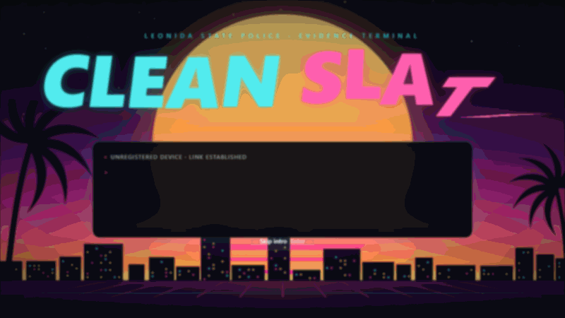
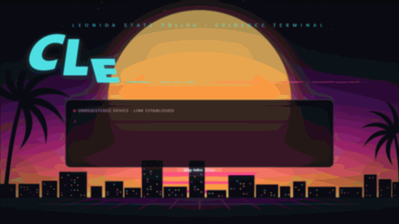

# CLEAN SLATE

> You are at six stars. You have no gun. You have access to the LSPD evidence server.
> Beat the wanted level by editing the evidence against you before it syncs.

A browser game built for the **Unlayer Build With React Image Editor Challenge** (`#BuiltWithImageEditor`).
The player breaks into a police evidence terminal and has five minutes to redact the exhibits that
identify them: a CCTV still, a traffic-camera capture, a police report, a news broadcast and a witness
photo. The [React Image Editor](https://github.com/unlayer/react-image-editor) is the game: every move the
player makes is an edit in the editor, and the score comes from measuring exactly which pixels they changed.

**Play it live: [clean-slate-beta.vercel.app](https://clean-slate-beta.vercel.app/)**

> **Status: playable.** The full loop works end to end in a real browser: boot, briefing, editing with the
> clock, forensic analysis and verdict, across all five exhibits (CCTV, traffic camera, police report, news
> broadcast, witness photo), with all four endings. It is deployed on Vercel.

<table>
  <tr>
    <td><br><sub>Boot: trip the alarm to start the clock</sub></td>
    <td><br><sub>Brief: what to conceal, what to leave alone</sub></td>
  </tr>
  <tr>
    <td><br><sub>Edit: the React Image Editor is the game</sub></td>
    <td><br><sub>Analysis: every region's cost or saving, and the linked car</sub></td>
  </tr>
  <tr>
    <td><br><sub>Analysis: the police report, a portrait page</sub></td>
    <td><br><sub>Verdict: CLEAN SLATE</sub></td>
  </tr>
  <tr>
    <td><br><sub>Verdict: TAMPERING CHARGE</sub></td>
    <td></td>
  </tr>
</table>

The look is a clean, modern interface over Vice City at dusk: soft glass cards and a bold system sans for
everything you have to read, with the striped sun, palms, skyline and scrolling grid kept behind it, siren lights
when the clock or the risk gets dangerous, and a wanted-stars HUD that tracks heat. Instructions and evidence
are kept free of scanlines and glow so they stay easy to read. All of it is vector art and CSS drawn in code,
so there are no image assets, and it uses system fonts only, so nothing can fail to load.

## Every ending, played for real

Four real playthroughs of the game, recorded from the production build. Nothing is mocked: each one is the
actual editor being driven, the actual save being scored, and the actual verdict.

<table>
  <tr>
    <td width="50%"><br><b>A successful clear.</b> Cover every target opaquely, leave every seal alone, and the file is clean: heat near zero, no stars, <b>CLEAN SLATE</b>.</td>
    <td width="50%"><br><b>Tripping the tamper seals.</b> Redact the integrity seals instead of the evidence and suspicion climbs with each breach. Two exhibits in, it maxes and the run ends at once with a <b>tampering charge</b>.</td>
  </tr>
  <tr>
    <td width="50%"><br><b>Not fully clear.</b> Four exhibits cleared perfectly, but the witness photo is left alone. Hiding the car in the traffic capture moved its heat there instead of removing it, so it is still on the file: <b>PARTIAL</b>, one star.</td>
    <td width="50%"><br><b>Running out the clock.</b> Do nothing and the five-minute clock expires. Everything syncs to the archive untouched: <b>SYNCED</b>, six stars.</td>
  </tr>
</table>

## The idea

Every exhibit is a piece of evidence with three kinds of region:

- **Targets** are what identifies you: a face, a plate, a name, a car. Conceal one and **heat** drops.
- **Integrity seals** are what proves the file is genuine: a timecode, a camera ID, a custody hash, a
  channel bug. Touch one and **suspicion** rises.
- **Collateral** is everything else. Change too much of the frame and suspicion rises.

Heat starts at 100. Clear it to 5 or below without pushing suspicion to 40 and you reach **CLEAN SLATE**:
zero stars, you were never there. Push suspicion to 100 and the run ends immediately with a new felony. Run
out the clock with the evidence untouched and everything syncs: still six stars.

There is one twist. Hiding the car in the traffic-camera capture is what makes it incriminating in the
witness photo: its heat **transfers** to that exhibit instead of disappearing, and you only remove it by
clearing the witness photo too.

## How the React Image Editor is used

The editor is not decoration; the whole game reads its output.

- **Locked-down toolset.** Crop, resize, filter and frame are switched off, because each would change the
  output dimensions or write pixels everywhere and break the comparison against the original. Draw, shapes,
  stickers and text stay on, renamed for the fiction: **Retouch**, **Redact**, **Overlay**, **Relabel**, with
  the save button renamed **COMMIT TO FILE**. It uses the dark theme and is docked left so it reads as a
  module of the terminal.
- **Options at module scope.** The options object is a module-level constant. Deeply-equal options objects
  can still produce different keys and force a full remount, which destroys the canvas and the undo history
  ([Unlayer issue #31](https://github.com/unlayer/react-image-editor/issues/31)), so one stable reference is
  passed every time.
- **Scoring the saved file, not the drawing.** On save, the game compares the returned image with the exact
  frame the player was given. It never inspects _what_ was drawn, only _where_ pixels changed, using the
  largest per-channel difference so a colour swap at equal brightness still counts.
- **Version pinned.** The editor bundle is fetched from a versioned CDN URL. Unpinned, "latest" moves
  whenever Unlayer ships and would silently change the export the scorer is calibrated on. The loader
  memoises its first `load()` call, so the pin is applied at boot, and the app logs an error if the loader
  ever falls forward to a different build.

### What testing the editor turned up


_The calibration harness (`?tracer`) after a black rectangle was dragged over the suspect's face and committed.
The panel is the scorer's readout for that saved file: the `face` target is 88% changed, both integrity seals
are untouched._

- **`onSave` returns JPEG, not PNG.** An untouched save is therefore not pixel-identical to the input, and
  the noise differs by frame: the crisp broadcast graphics ring hardest.
- **One global threshold does not work.** At the starting value, an untouched news frame scored one of its
  seals over the breach line, so a player who changed nothing would be charged. Raising the threshold fixed
  that but then gave only about half credit for _fully_ covering a dark target, because black over
  near-black barely changes. The threshold is now set per exhibit from 77 real-editor test runs (drags,
  brush strokes, translucent overlays, seal nicks, whole-frame blackouts) across the CCTV, traffic camera,
  police report, news broadcast and witness photo.
- **Seals get a stricter threshold than targets.** The two mistakes are not symmetric: under-crediting a
  fully opaque edit is unfair to the player, but charging a seal breach for an edit that never touched it is
  worse. The news broadcast needs a sensitive threshold for its cream-on-navy strap but a robust one for its
  crisp white-on-red channel bug, so seals can use their own value (0.002 untouched cover at 48, against
  0.034 at the target threshold of 32, with the breach line at 0.05).
- **Known limit.** Scoring by how much pixels changed cannot tell a readable translucent overlay from an
  opaque one, so a 50% overlay can still earn credit. The rule the player is given is: cover it opaquely.
- **Loading is handled.** If the editor's CDN is blocked or slow, the player gets a clear screen with Try
  again and Skip this exhibit instead of a spinner, the clock stays held, and a retry goes through the same
  version-pinned loader so a recovery cannot change the export the scorer is calibrated on.

## The evidence

All five exhibits are drawn on a canvas at runtime. There are no image files and no sourced artwork of any kind: no Rockstar artwork and no
captured game footage, so nothing is sourced. Each generator returns the picture together with the exact rectangles of
its targets and seals, drawn by the same code that painted them, so regions are known rather than detected.

<table>
  <tr>
    <td><br><sub>01 · CCTV still</sub></td>
    <td><br><sub>02 · ANPR traffic cam</sub></td>
  </tr>
  <tr>
    <td><br><sub>04 · News broadcast</sub></td>
    <td><br><sub>03 · Police report</sub></td>
  </tr>
  <tr>
    <td><br><sub>05 · Witness photo (same car as 02)</sub></td>
    <td></td>
  </tr>
</table>

## Scoring

```
cover(group) = changed pixels in the union of the group's rects / area of the union
credit(c)    = 0 below 0.40, linear to 1 at 0.75
credit       = MIN over a target's groups of credit(cover(group))
heat        -= normalisedWeight * credit

seal breach  : any rect of a seal with cover > 0.05   -> +30 suspicion, once per seal
collateral   : changed pixels outside every target / pixels outside
               if > 0.30 -> += (c - 0.30) * 150
```

Weights are normalised over the exhibits actually shipped, so a perfect run always reaches zero heat. A
target's rects are grouped: the fragments of one car body are unioned (so a thin sliver cannot veto the
whole car), but the witness photo's car plate is its own group, because a legible plate is a separate clue.

The endings resolve in order: **Tampering** (suspicion ≥ 100), **CLEAN SLATE** (heat ≤ 5 and suspicion < 40),
**Synced** (clock expired with heat above 60, six stars) and **Partial** (1–5 stars from remaining heat).
A save and a timeout can never score an exhibit twice, and a save already in flight beats the clock.

## Run it

```bash
npm install
npm run dev      # the game at http://localhost:5173
npm test         # 48 tests for the game logic, no browser needed
npm run build    # typecheck and production build
```

Handy URLs while developing:

- `/?clock=15` shortens the five-minute clock to 15 seconds, to see the timeout ending.
- `/?tracer` opens the calibration harness. `/?frame=1` to `/?frame=5` loads a specific exhibit in it: press
  **COMMIT TO FILE** with no edits to measure the export noise for that frame, or draw an edit and read the
  per-region coverage.

## Project layout

```
src/
  frames/    sensor.ts, evidence.ts   the five procedural generators and the camera-sensor pipeline
  scoring/   diff.ts                  pixel diff on a fixed canvas
             score.ts                 credit, group cover, breach and collateral rules
             measure.ts               compare a saved image with the original, per region
             calibration.ts           editor version pin, per-exhibit thresholds, measured noise floors
  game/      case.ts                  exhibits, weights, the car chain, region grouping, frame checks
             reducer.ts               BOOT / BRIEF / EDIT / ANALYSIS / VERDICT state machine
             game.test.ts             tests for the budget, the chain, suspicion, endings, exactly-once
  ui/        Editor.tsx               the editor wrapper with module-scope options
             preloadEditor.ts         pinned, early load of the editor bundle
             Chrome.tsx               the HUD: exhibit counter, clock, wanted stars, tampering risk
             Outlines.tsx             region outlines drawn over an exhibit
             copy.ts                  the handler's text
             screens/                 Boot, Brief, Edit, Analysis, Verdict
             vice/                    the Vice City backdrop, glitch, stars, sirens, wipe, typing
             Tracer.tsx               the calibration harness
```

Built with Vite, React 18, TypeScript and Tailwind v4, with `@unlayer/react-image-editor` for editing and
`motion` for the animation. It is entirely client-side: no backend, no database.

## Roadmap

- [x] Evidence generators, editor integration, pixel scoring and calibration
- [x] Game state machine with heat, suspicion, the car chain and all four endings
- [x] Game screens: boot, brief, edit with the clock, analysis, verdict
- [x] Police report and news broadcast calibrated and added to the run
- [x] A modern, readable look, and reliable editor loading with a way out
- [x] Deployed on Vercel, with recorded playthroughs of every ending

## Disclaimer

An unofficial fan project inspired by the setting of GTA VI. It is not affiliated with or endorsed by
Rockstar Games or Take-Two Interactive. Every visual is generated by code at runtime, and all brands in the
game are invented.
