# CLEAN SLATE

**▶ Play it now: [clean-slate-beta.vercel.app](https://clean-slate-beta.vercel.app/)**

> You are at six stars. You have no gun. You have access to the LSPD evidence server.
> Beat the wanted level by editing the evidence against you before it hits the archive.

A browser game for the **Unlayer Build With React Image Editor Challenge** (`#BuiltWithImageEditor`). You break
into a police evidence server and get five minutes to hide what puts you at the scene, across five files: a CCTV
still, a traffic-camera capture, a police report, a news broadcast and a witness photo. The
[React Image Editor](https://github.com/unlayer/react-image-editor) is the game: every move is an edit in the
editor, and the score comes from measuring exactly which pixels you changed.

- **One connected case, not five puzzles.** Hiding the car in the traffic-camera shot does not make it go away:
  its heat _moves_ to the witness photo and stays on your file until you clear it there too.
- **Every visual is original.** The five exhibits, the sunset backdrop and the interface are all generated in
  code at runtime. No screenshots, no stills, no Rockstar material.
- **The scoring is measured, not guessed.** It reads the editor's real saved output, with thresholds calibrated
  from 77 real-editor runs.

<table>
  <tr>
    <td>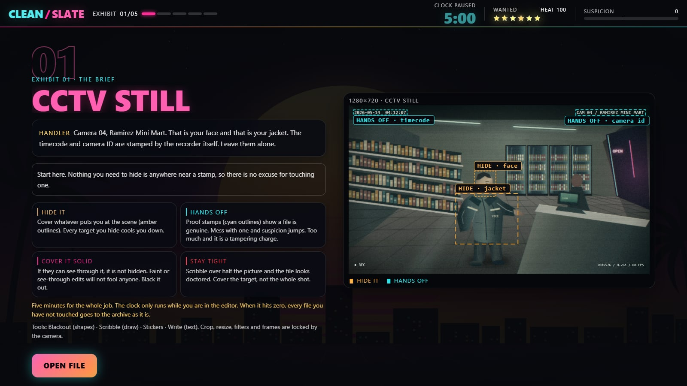<br><sub>Brief: what to hide, what to leave alone</sub></td>
    <td>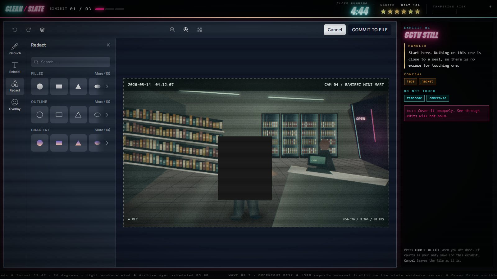<br><sub>Edit: the React Image Editor is the game</sub></td>
  </tr>
  <tr>
    <td>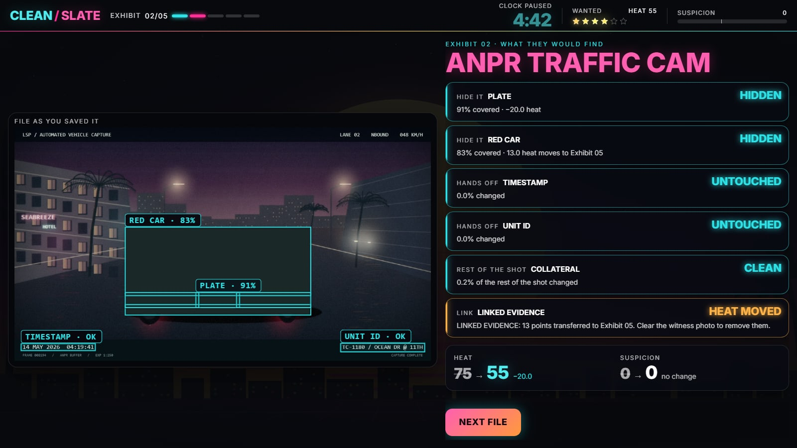<br><sub>Analysis: what each region cost or saved, and the linked car</sub></td>
    <td>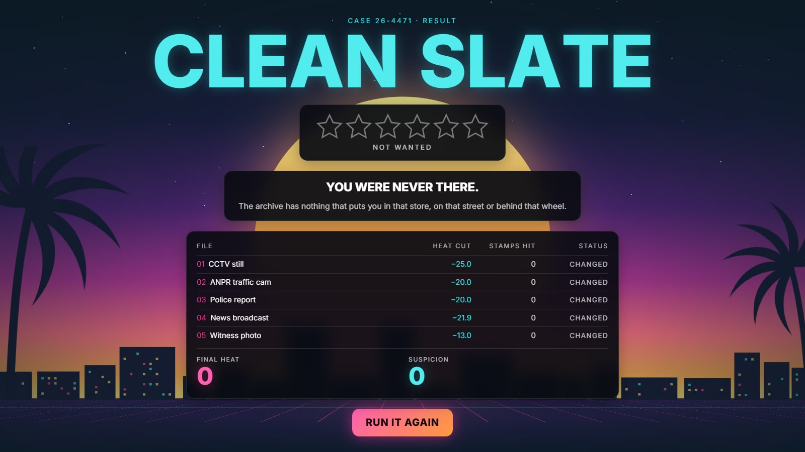<br><sub>Verdict: CLEAN SLATE</sub></td>
  </tr>
</table>

## A full run, played for real

Recorded at normal speed from the production build. Nothing is mocked: it is the real editor, the real save being
scored and the real verdict. Cover every target solid, leave every proof stamp alone, and you reach **CLEAN SLATE**.

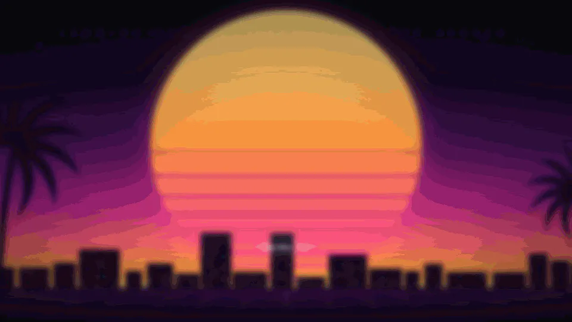

<details>
<summary><b>The other three endings</b> (tampering charge, still wanted, busted)</summary>

**Messing with the proof stamps: TAMPERING CHARGE.** Black out the stamps instead of the evidence and suspicion
climbs with each one. Two files in, it maxes and the run ends at once.

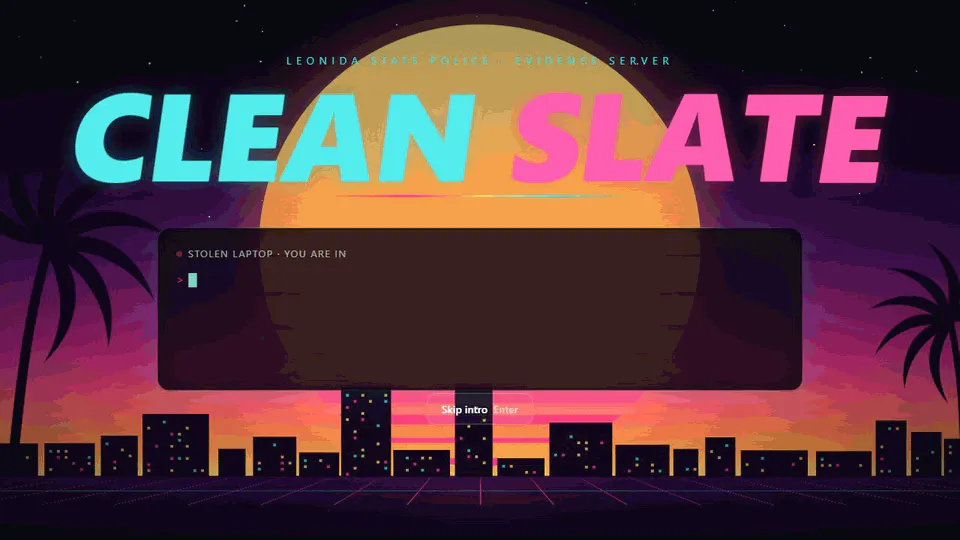

**Walking away: STILL WANTED.** Clear the first two files, including the car, then walk away. The car's heat moved
to the witness photo, so it is still on your file: four stars.

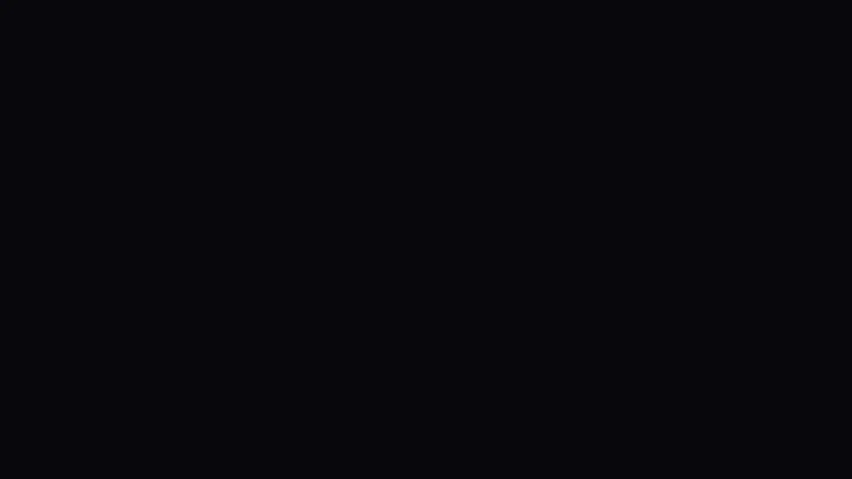

**Running out the clock: BUSTED.** Do nothing and every file goes to the archive untouched: six stars. (Recorded on
a shortened clock, `/?clock=22`.)

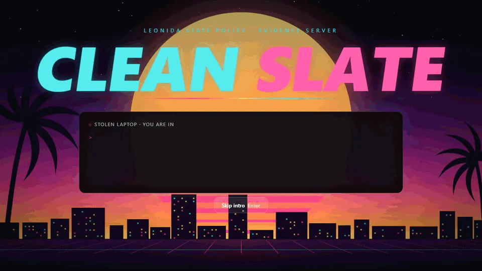

</details>

## The idea

Every file has three kinds of region:

- **Targets** are what identifies you: a face, a plate, a name, a car. Hide one and **heat** drops.
- **Proof stamps** (integrity seals in the code) show the file is genuine: a timecode, a camera ID, a custody
  hash, a channel logo. Touch one and **suspicion** rises.
- **Collateral** is everything else. Change too much of the frame and suspicion rises.

Heat starts at 100. Get it to 5 or below with suspicion under 40 and it is **CLEAN SLATE**: zero stars, you were
never there. Push suspicion to 100 and the run ends at once with a new felony. Run out the clock and every file
you have not touched goes to the archive as it is.

## How the React Image Editor is used

The editor is not decoration; the whole game reads its output.

- **Locked-down toolset.** Crop, resize, filter and frame are off, because each would change the output size or
  write pixels everywhere and break the comparison with the original. Draw, shapes, stickers and text stay on,
  renamed for the fiction (**Scribble**, **Blackout**, **Stickers**, **Write**), with the save button renamed
  **SAVE FILE**. Dark theme, docked left, so it reads as part of the terminal.
- **Scoring the saved file, not the drawing.** On save, the game compares the returned image with the exact frame
  the player was given. It never inspects _what_ was drawn, only _where_ pixels changed.
- **Options at module scope.** Deeply-equal options objects can still force a full remount, which destroys the
  canvas and undo history ([Unlayer issue #31](https://github.com/unlayer/react-image-editor/issues/31)), so one
  stable reference is passed every time.
- **Version pinned.** The bundle is loaded from a versioned CDN URL, so "latest" cannot silently change the
  export the scorer is calibrated on. The app logs an error if the loader ever falls forward to another build.

<details>
<summary><b>What testing the editor turned up</b></summary>

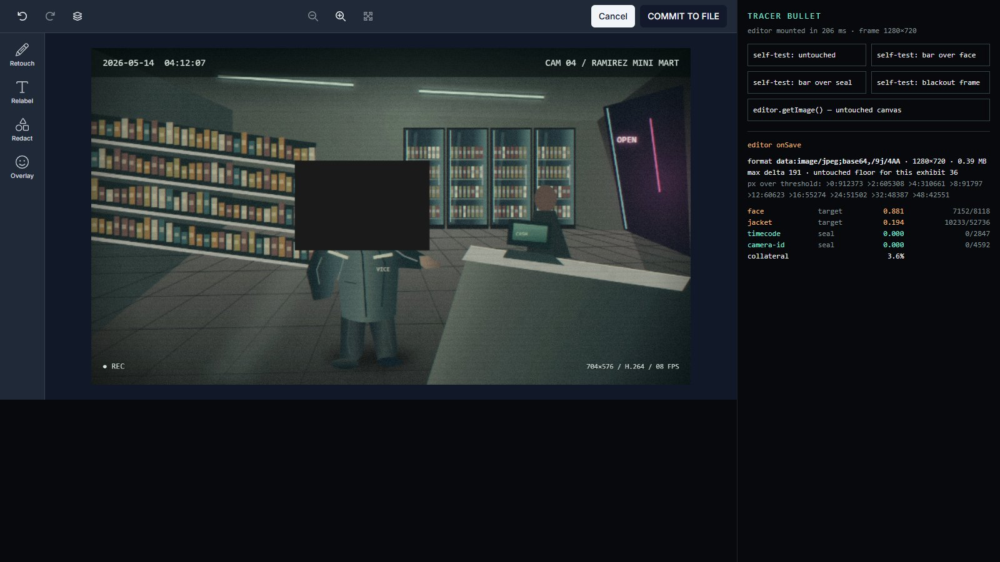

_The calibration harness (`?tracer`) after a black rectangle was dragged over the suspect's face and saved. The
panel is the scorer's readout: the `face` target is 88% changed, both seals are untouched._

- **`onSave` returns JPEG, not PNG.** An untouched save is not pixel-identical to the input, and the noise differs
  by frame: the crisp broadcast graphics ring hardest.
- **One global threshold does not work.** At the starting value, an untouched news frame scored a seal over the
  breach line, so a player who changed nothing would be charged. Raising it fixed that but gave only about half
  credit for fully covering a dark target. The threshold is now set per exhibit, from 77 real-editor runs (drags,
  brush strokes, translucent overlays, seal nicks, whole-frame blackouts).
- **Seals get a stricter threshold than targets.** Under-crediting an opaque edit is unfair, but charging a breach
  for an edit that never touched the seal is worse. Seals use their own value (0.002 untouched cover at 48,
  against 0.034 at the target threshold of 32, with the breach line at 0.05).
- **Known limit.** Scoring by pixel change cannot tell a readable translucent overlay from an opaque one, so the
  rule the player is given is: cover it solid.
- **Loading is handled.** If the CDN is blocked or slow, the player gets Try again and Skip this file instead of a
  spinner, the clock stays frozen, and a retry goes through the same pinned loader.

</details>

## Scoring

```
cover(group) = changed pixels in the union of the group's rects / area of the union
credit(c)    = 0 below 0.40, linear to 1 at 0.75
credit       = MIN over a target's groups of credit(cover(group))
heat        -= normalisedWeight * credit

seal breach  : any rect of a seal with cover > 0.05   -> +30 suspicion, once per seal
collateral   : changed pixels outside every target / pixels outside
               if > 0.30 -> += (c - 0.30) * 150
```

Weights are normalised over the files actually in the run, so a perfect run always reaches zero heat. The
fragments of one car body are unioned (a thin sliver cannot veto the whole car), but the witness photo's plate is
its own group, because a legible plate is a separate clue.

Endings resolve in order: **Tampering charge** (suspicion ≥ 100), **CLEAN SLATE** (heat ≤ 5 and suspicion < 40),
**Busted** (`SYNCED` in the code: heat above 60 and the clock expired or nothing changed; six stars), **Still
wanted** (`PARTIAL`: 1–5 stars from remaining heat). A save and a timeout can never score a file twice.

## Run it

```bash
npm install
npm run dev      # http://localhost:5173
npm test         # 54 tests for the game logic, no browser needed
npm run build    # typecheck and production build
```

`/?clock=15` shortens the clock to 15 seconds. `/?tracer` (or `/?frame=1` to `/?frame=5`) opens the calibration
harness, where SAVE FILE with no edits measures the export noise for that frame.

Built with Vite, React 18, TypeScript, Tailwind v4, `@unlayer/react-image-editor` and `motion`. Entirely
client-side: no backend, no database, no image assets, system fonts only.

<details>
<summary><b>The five exhibits</b> and the <b>project layout</b></summary>

All five are drawn on a canvas at runtime. Each generator returns the picture together with the exact rectangles of
its targets and seals, drawn by the same code that painted them, so regions are known rather than detected.

<table>
  <tr>
    <td>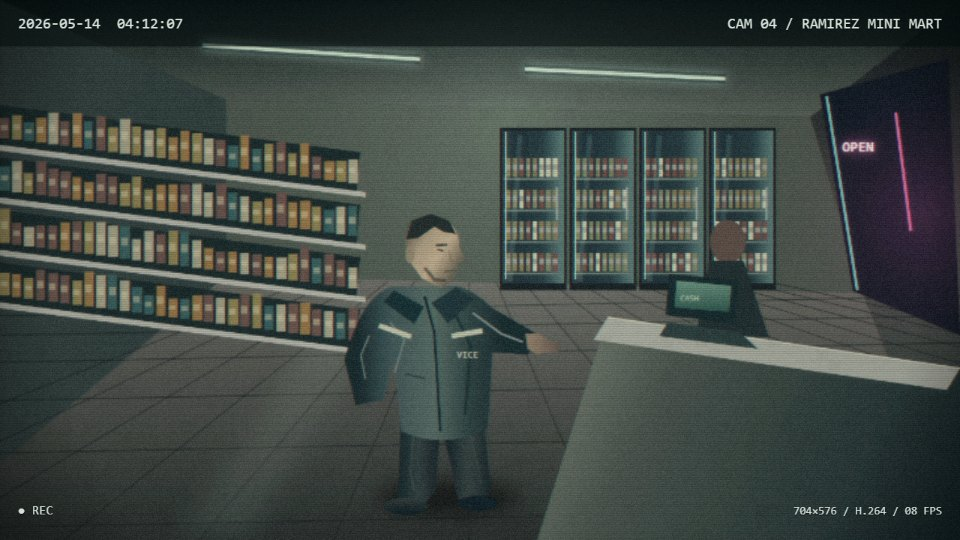<br><sub>01 · CCTV still</sub></td>
    <td>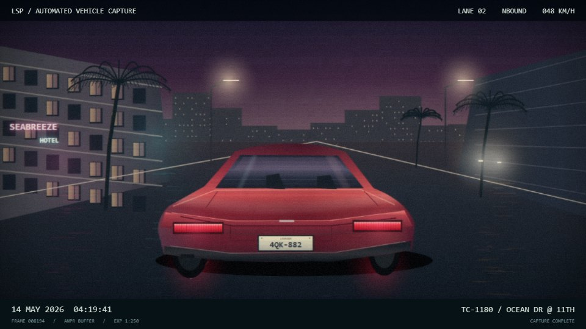<br><sub>02 · ANPR traffic cam</sub></td>
  </tr>
  <tr>
    <td>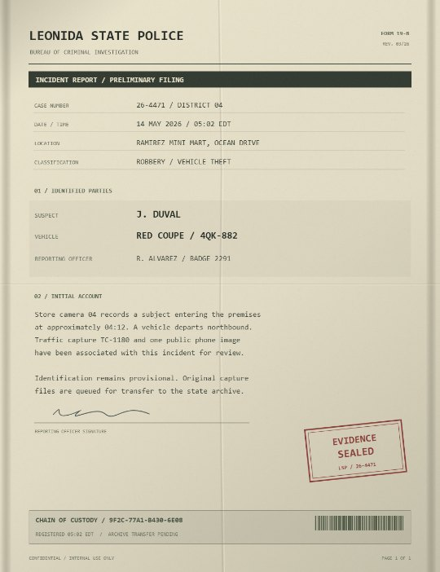<br><sub>03 · Police report</sub></td>
    <td>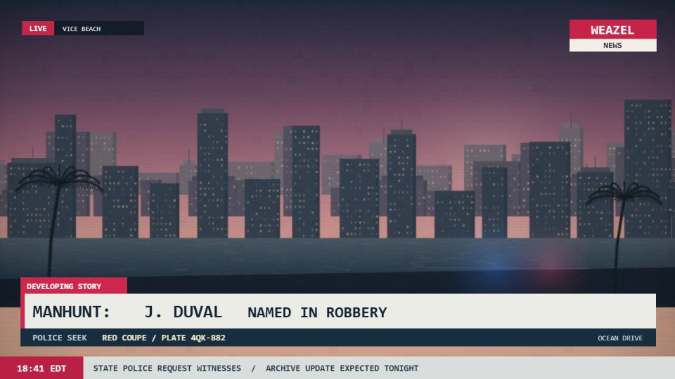<br><sub>04 · News broadcast</sub></td>
  </tr>
  <tr>
    <td>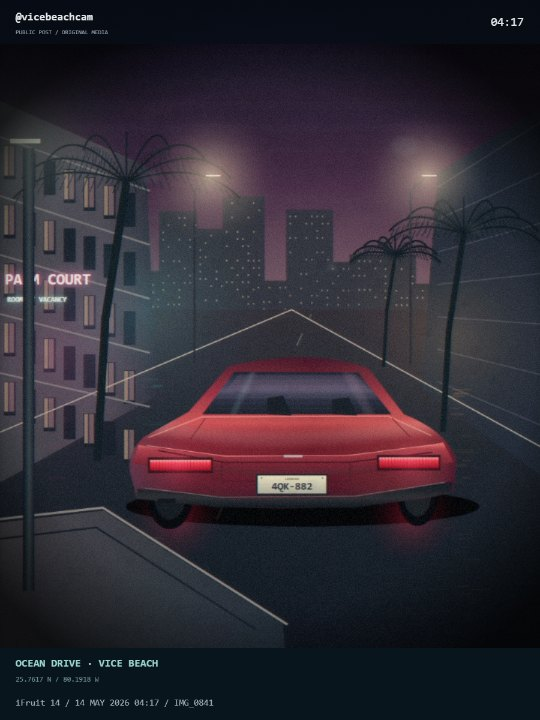<br><sub>05 · Witness photo (same car as 02)</sub></td>
    <td></td>
  </tr>
</table>

```
src/
  frames/    sensor.ts, evidence.ts   the five procedural generators and the camera-sensor pipeline
  scoring/   diff.ts, score.ts        pixel diff, credit / breach / collateral rules
             measure.ts               compare a saved image with the original, per region
             calibration.ts           editor version pin, per-exhibit thresholds, measured noise floors
  game/      case.ts                  exhibits, weights, the car chain, region grouping
             reducer.ts               BOOT / BRIEF / EDIT / ANALYSIS / VERDICT state machine
             game.test.ts             budget, chain, suspicion, endings, exactly-once
  ui/        Editor.tsx               the editor wrapper with module-scope options
             preloadEditor.ts         pinned, early load of the editor bundle
             Chrome.tsx, copy.ts      the HUD and the handler's text
             screens/                 Boot, Brief, Edit, Analysis, Verdict
             Tracer.tsx               the calibration harness
```

</details>

## Disclaimer

An unofficial fan project inspired by the setting of GTA VI. It is not affiliated with or endorsed by Rockstar
Games or Take-Two Interactive. Every visual is generated by code at runtime, and all brands in the game are
invented.
